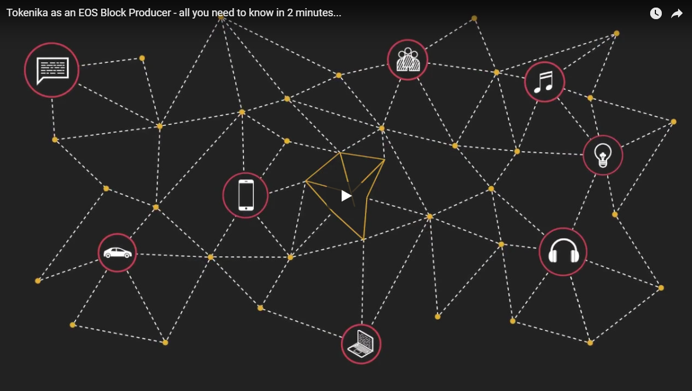

## Tokenika as an EOS block producer

## Latest news

## Who we are?

[Tokenika](https://tokenika.io/) is a Warsaw-based, Eastern European blockchain expert, software house and a think-tank specializing in blockchain and distributed ledger technologies. Consisting of a strong team of experts from the fields of IT, coding, artificial intelligence, trading, law and regulatory environments, we strive to create a foundation for the most promising blockchain related tech.

Our team members have been involved in blockchain and DLT tech since 2012, and have been firm supporters of [Dan Larimer](	https://en.wikipedia.org/wiki/Daniel_Larimer)’s projects since the introduction of BitSharesX, the first incarnation of [BitShares](https://bitshares.org/).

Currently Tokenika’s efforts are exclusively dedicated to successful deployment of [EOSIO](https://eos.io/) ecosystem, in our eyes being one of the brightest new stars on the blockchain scene.

As a potential block producer, we are acutely aware of the scale and complexity of this task.

## What we do?

We started as one of the earliest entities aiming to become an EOS block producer (back in August 2017) and thanks to a long & consistent track record we [have been recognized](https://steemit.com/eos/@eosnewyork/your-vote-matters-5-examples-of-good-block-producers) as a valuable contributor.

#### Contributing to EOS ecosystem

We’re creating [EOS Factory](https://github.com/tokenika/eosfactory), a Python-based smart-contract development & testing framework, similar to Ethereum’s [Truffle Framework](http://truffleframework.com/). Also, we’re the team behind [EOS Projects](https://eosprojects.org/), a comprehensive directory of apps, sites and tools in the EOS ecosystem, and [EOS Offline Voting](https://github.com/tokenika/secure-bp-voting), a secure mechanism for casting votes for block producers.

#### Contributing to EOS publicity

We spread the word and present EOS at high-profile events [[Blockchain Connect](http://connectwarsaw.org/) in Warsaw] and at blockchain conferences in Poland, Europe & Asia [[Warsaw](https://www.facebook.com/events/903326303125907/), [Wrocław](https://www.meetup.com/pl-pl/wroclaw-blockchain-meetup/events/246349912/?eventid=246349912), [Łódź](https://www.facebook.com/events/160585741214328/), [Poznań](https://www.facebook.com/events/873585539479089/), [Szczecin](https://www.meetup.com/pl-pl/szczecin-blockchain-meetup/events/247984199/), [Oslo](https://steemit.com/eos/@bitspace/bitspace-hosts-scandinavia-s-first-ever-eos-meetup-in-oslo-norway), [Beijing](https://medium.com/@oraclechain/2018-global-eos-developer-conference-9db444ec2cd7)].

#### Contributing to the community

We lead an active EOS community and have a [lively following](https://steemit.com/@tokenika) on the Steem platform, where we educate and offer advice on technological and practical subjects regarding EOS.

#### Bringing businesses to EOS

We provide consultancy services for companies who consider building or migrating large-scale businesses to EOS. To-date cooperation includes work with [Parsec Frontiers](http://parsecfrontiers.com/), [Builder Commerce](http://buildercommerce.com/), [Send Gold](http://sendgold.com/), [Trans EU](https://www.trans.eu/en/).

#### Building dApps on EOS

We’ve set out to create our own dApps on EOS. We’re building [Sygnet](http://sygnet.eu/), a cryptographic identity verification tool taking advantage of the opportunities opened up by [the European PSD2 legislation](https://www.evry.com/en/news/articles/psd2-the-directive-that-will-change-banking-as-we-know-it/), and [Joint](https://mail.google.com/mail/u/0/?api_endpoint=), an ontology-based social network.

#### Advising public institutions

As we believe in a smooth transition from traditional economy to decentralized one, we advise the Polish Ministry of Digitization on [blockchain-related matters](http://bitcoin.pl/wiadomosci/prawo-i-polityka/1636-powstala-grupa-robocza-ds-blockchain-i-kryptowalut-przy-knf), and have early insight into Poland’s and EU’s blockchain regulatory landscape.

## Financing and transparency

We have advocated the need for transparency of block producers operations quite early on. We see a BP’s role as a neutral supporter of the ecosystem. BP’s should never get involved in politics, taking sides, or running undisclosed business operations on the back of their BP income.

Our BP financing plan assumes, that in case of a vivid surplus of income from the BP node, we are going to redistribute a part of this back into the system, in form of development of dApps, developer education and boots-on-the-ground promotion of EOS.

The financing of the datacenters, as well as the money, flows stemming from the BP node are all going to be made public by Tokenika. Also note, that we are a business, and profit is one of our aims, so do not expect a Robin Hood type of approach - in order to serve the EOS community well, we need to remain self-sustainable.

## Code of conduct

As to the written policy on vote buying and governance, it can be summarised in two paragraphs:

- We are against vote buying in any form or shape, and are not, and will not be offering any profit sharing with our voters. Our contribution to the system has always been in form of adding value, and not crude redistribution of income.
- We will abide by the EOS constitution at all times - Tokenika’s BP is a mere servant, and at best, an advisor for the EOS community, even if the public ruling stands in conflict with our personal views.

Having said that, we are not advocates for heavy regulation of business practices around EOS. In our view, young distributed systems must find a natural market equilibrium. Stark regulation, arbitration and other penalizing measures open up a can of worms, in which authority has to be imposed externally, and might result in forking of chains, endless disputes, or even render the system unstable. We are libertarians at heart and believe that market forces always find a way to balance things out.

## BP infrastructure

Our block production infrastructure has been setup and fine-tuned by [GTG](https://steemit.com/@gtg), one of the best performing Steem witness nodes, consistently scoring in the top 3 for the least amount of dropped blocks.

- It is robust and most importantly, rapidly scalable, largely due to our Steem witness know-how. We are not just hoping this is the case, we know it.
- We use industry grade Tier 3+ datacenters with fail-over protection and an up-time of around 99.9%.

All the above separates us from many inexperienced witness candidates who are forced to adopt a trial-and-error approach to this task, and might lack the skills or the infrastructure to set up and sustain a stable EOS node.

## How to support us?

Our block producer node is called `tokenika4eos`. If security is your primary concern, we recommend using our [off-line voting mechanism](https://github.com/tokenika/secure-bp-voting). If you prefer a more straight-forward approach, please refer to [this excellent guide](https://steemit.com/eos/@eosnewyork/the-eos-mainnet-launch-survival-guide-how-to-avoid-scams) provided by [EOS New York](https://www.eosnewyork.io/).