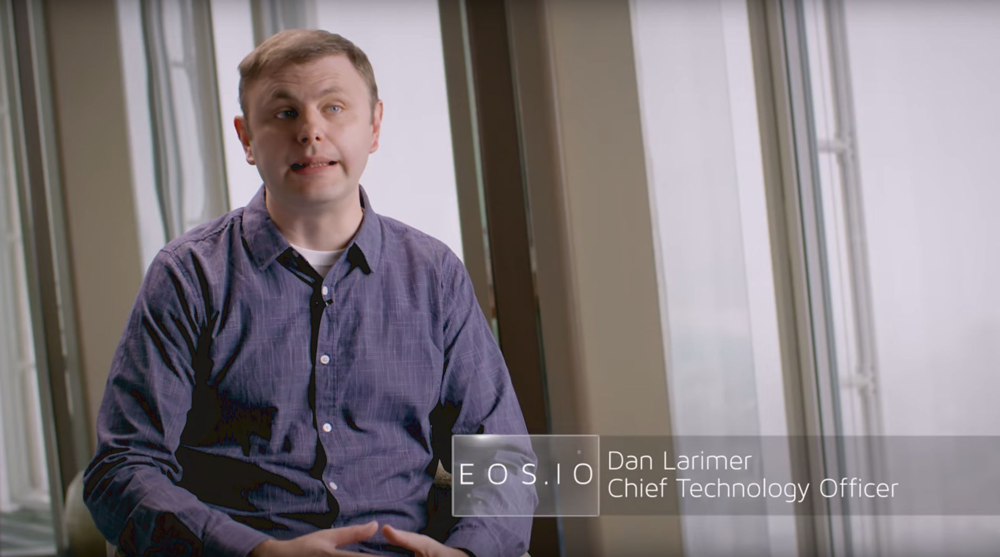

# News

# Why blockchain?

# Who are we?

BitSpace is an incubator focusing on creating synergies between exponential technologies, such as cryptocurrency, the Internet of Things, BCI, VR and AI. We combine these technologies to create new, innovative and disruptive solutions for the future. BitSpace is also an excellence center and does Bitcoin and blockchain consultancy. We build tailored blockchain solutions for our customers and arrange courses and seminars for businesses and for people in private.

# Delegated Proof of Stake

#### What is it?

Delegated Proof of Stake (DPOS) is the fastest, most efficient, most decentralized, and most flexible consensus model available. DPOS leverages the power of stakeholder approval voting to resolve consensus issues in a fair and democratic way. All network parameters, from fee schedules to block intervals and transaction sizes, can be tuned via elected delegates. Deterministic selection of block producers allows transactions to be confirmed in an average of just 1 second. Perhaps most importantly, the consensus protocol is designed to protect all participants against unwanted regulatory interference.

#### Why do we focus on DPOS?

Lorem ipsum dolor sit amet, consectetur adipiscing elit. Aliquam at porttitor sem. Aliquam erat volutpat. Donec placerat nisl magna, et faucibus arcu condimentum sed. Lorem ipsum dolor sit amet, consectetur adipiscing elit. Aliquam at porttitor sem.

#### What blockchain systems use DPOS?

Lorem ipsum dolor sit amet, consectetur adipiscing elit. Aliquam at porttitor sem. Aliquam erat volutpat. Donec placerat nisl magna, et faucibus arcu condimentum sed. Lorem ipsum dolor sit amet, consectetur adipiscing elit. Aliquam at porttitor sem.

# Why EOS?

Lorem ipsum dolor sit amet, consectetur adipiscing elit. Aliquam at porttitor sem. Aliquam erat volutpat. Donec placerat nisl magna, et faucibus arcu condimentum sed. Lorem ipsum dolor sit amet, consectetur adipiscing elit. Aliquam at porttitor sem.

# What do we do?

#### Long-term digital assets investments

Our focus is on blockchain-based fundraising and digital asset management solutions, e.g. [Neufund](https://neufund.org/), [Melonport](https://melonport.com/), [Iconomi](https://www.iconomi.net/).

#### DLT Incubator

Bitspace is an incubator of startup companies. These business models incorporate technologies such as Blockchain, Space, Artificial Intelligence and Virtual Reality. For consideration please contact us directly.

#### Software house for EOS/ETH dApps

When Android was entering the market, the best strategy for Android-based businesses was to identify the most successful apps on iOS and implement them on Android. We want to follow a similar path with EOS, as we believe that EOS, once launched in Q3 2018, will be much more scalable, business-oriented and production-ready than Ethereum.

# What do we offer?

Lorem ipsum dolor sit amet, consectetur adipiscing elit. Aliquam at porttitor sem. Aliquam erat volutpat. Lorem ipsum dolor sit amet, consectetur adipiscing elit. Aliquam at porttitor sem. Aliquam erat volutpat.

#### EOS CLI & API (TEOS)

Lorem ipsum dolor sit amet, consectetur adipiscing elit. Aliquam at porttitor sem. Aliquam erat volutpat.

#### EOS Projects

Lorem ipsum dolor sit amet, consectetur adipiscing elit. Aliquam at porttitor sem. Aliquam erat volutpat.

#### EOS Explorer

Lorem ipsum dolor sit amet, consectetur adipiscing elit. Aliquam at porttitor sem. Aliquam erat volutpat.

#### EOS Faucet

Lorem ipsum dolor sit amet, consectetur adipiscing elit. Aliquam at porttitor sem. Aliquam erat volutpat.

#### EOS Info

Lorem ipsum dolor sit amet, consectetur adipiscing elit. Aliquam at porttitor sem. Aliquam erat volutpat.

# Core Team

Lorem ipsum dolor sit amet, consectetur adipiscing elit. Aliquam at porttitor sem. Aliquam erat volutpat.

#### Tomasz Michalski, CEO & co-founder

Visionary, experienced manager & entrepreneur. Active in commerce and manufacturing industry. Built a prosperous door factory from the ground up, without prior experience in the industry. Strong business connections with China since 2006. Early adopter and miner of major crypto-currencies, including BTC, LTC, ETH. Currently an investor and big supporter of EOS.

#### Dominik Walaszek, co-founder

Entrepreneur and investor. CEO and co-owner of a manufacturing enterprise employing over 700 people. Early adopter of Industry 4.0 concept. Inspired by convergence of decentralized technologies. Educational background in corporate finance. Started with Ethereum, now a strong believer in EOS.

#### Jakub Zarembiński, co-founder

Entrepreneur, DLT consultant & researcher. Capable programmer specializing in Java and R. Over 12 years of experience, including 7 years with the banking sector. Expert in IT and business, especially in the domain of blockchain development and machine learning. Long-time supporter of BitShares, Steem and now EOS.

#### Krzysztof Szumny, co-founder

Lorem ipsum dolor sit amet, consectetur adipiscing elit. Aliquam at porttitor sem. Aliquam erat volutpat. Donec placerat nisl magna, et faucibus arcu condimentum sed. Lorem ipsum dolor sit amet, consectetur adipiscing elit. Aliquam at porttitor sem.

#### Jacek Kusiak, co-founder

For more than 20 years active investor on the stock exchange (S&P500, DAX, CAC40, WIG) and real estate markets. President of the biggest Real Estate Association "Mieszkanicznik", with 20 offices around the world and 8k active investors. Currently involved in Ethereum, EOS, Bitcoin, Tezos projects and other upcoming ICOs.

#### Patryk Perduta, developer

Lorem ipsum dolor sit amet, consectetur adipiscing elit. Aliquam at porttitor sem. Aliquam erat volutpat. Donec placerat nisl magna, et faucibus arcu condimentum sed. Lorem ipsum dolor sit amet, consectetur adipiscing elit. Aliquam at porttitor sem.

# Partners & advisors

#### GTG

One of the active Steem witnesses. IT Wizard. System administrator. Systems architect. Security analyst. Penetration tester. Data recovery and forensic specialist. Specialties: System administration, Security, Data Recovery and Forensic, Developer Environments, Virtual Environments, Heterogeneous Systems, Software testing, High Availability, High Performance Servers, Hosting Services, Debian GNU/Linux.

#### Krzysztof Piech

Professor at Lazarski University (among the best in Poland), former senior lecturer at the Institute of Political Economy, Law and Economic Policy, Warsaw School of Economics (SGH); President of the Institute of Knowledge and Innovation (Warsaw); CEO at Blockchain Technologies (Warsaw) and CEO at InvestOn Ltd.

#### Paweł Pacewicz

Data scientist passionate about cryptocurrency, blockchain & data driven business with wide experience of IT business development. Experience supported with wide education: Executive MBA, Data Science, Mathematics, Probability and Statistics.

# Career

#### With us

- Be able to work with DLT and other exponential technologies, such as Blockchain, A.I, V.R and Gaming
- Have influence in a young and growing company
- Have good career opportunities
- Get to negotiate preferable deals for bonuses and options
- Have a flexible work schedule
- Take part in building the future

#### We are looking for people who

- Are interested in DLT and other exponential technologies
- Have passion for future technology
- Are engaged and willing to learn and explore
- Want to take part in starting new and exciting projects

# Contact

If you have any questions or suggestions, please do not hesitate to contact us at [contact@tokenika.io](mailto:contact@tokenika.io)

### 