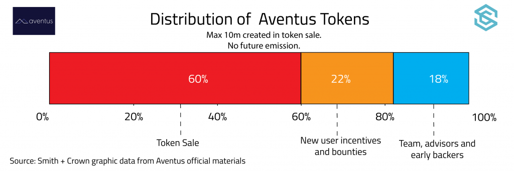

# Aventus: a blockchain-based event ticketing solution.

### What is the project?

Aventus aims to be a decentralized, autonomous protocol for the exchange of event tickets. The project’s main objective is to bridge the primary and secondary market for ticket sales by reducing the profitability of ticket scalping, fraud and other rent-seeking behaviors. The development team imagines Aventus as an open source protocol that will serve as the underlying layer for the online event ticket market.

Aventus aims to tackle three major problems with the existing online event ticket market.

- **Predatory scalping prevention:** Currently, it is common for event organizers and artists to offer tickets at [below market values](http://jimmyatkinson.com/papers/the-economics-of-ticket-scalping/), that is, at a flat rate below the price that the tickets would likely sell at auction. Ticket sellers on the primary markets do this in order to make event tickets accessible to fans and maximize audience size in the hopes of earning more revenue from in-event sales. As a result, predatory ticket scalpers and sophisticated bots buy up event tickets at relatively low retail prices and offer them on secondary markets at inflated prices. According Ticketmaster, as much as [60 percent](http://www.nytimes.com/2013/05/27/business/media/bots-that-siphon-off-tickets-frustrate-concert-promoters.html) of tickets for high profile events are purchased by these kinds of bots. These opportunistic secondary markets syphon profits away from artists and drive up ticket price.
- **Lack of oversight & consumer confusion:** There is a lack of oversight of the secondary market, which makes fraud a major concern. Ticket buyers are often unable to verify the legitimacy of event tickets sold on the secondary market, or may even be unsure if a ticket offering is taking place on the primary or secondary market in the first place.
- **Siloed nature of online ticket markets**: Currently, online ticket retailers operate in silos, limiting the benefits of economies of scale and encouraging anti-competitive business practices. Furthermore, there is a lack of communication and coordination between the primary and secondary markets.

Event tickets will be digital and associated with the buyer’s identity, though the technology for ticket redemption were not discussed in depth in the white paper.

**Bridging the primary & secondary markets**

Aventus proposes combining the primary and secondary ticket markets into one rail, giving event sponsors and organizers the power to customize the terms of how tickets are sold on each market. Ticket sellers will be able to customize ticket sales terms on a number of levels.

- Choose between auction, dynamic and plat pricing models.
- Public or private events
- Tiered ticket categories (e.g. Orchestra, mezzanine, balcony etc.)
- Capping the number of tickets that can be sold on secondary markets
- Setting fees for tickets sold on secondary markets, which allows event organizers and artists to profit from the resale of tickets.

The secondary market will also be controlled in other ways which aren’t customizable. Ticket buyers will be required to provide identifying information, such as a photo or an I.D. of some kind, when they create an account on the network. Any tickets they purchase will then be associated with their account ID on the blockchain. In this way, tickets can be tracked when they are put up for re-sale on the secondary market.

In addition, the secondary market is anonymized much like buyers and sellers on an asset exchange are. Sellers are matched with committed buyers, but their identities are kept secret. This prevents sellers on the secondary market from ostensibly following the rules of the Aventus protocol, but then collecting additional payments off-chain because they don’t know who the buyers are.

Aventus hopes that these controls will reduce the economic incentive of scalping tickets and help eliminate the types of rent seeking behaviors that currently cause friction between the primary and secondary ticket sale markets.

**Fraud prevention & Consumer Protection**

Aventus plans on combating fraud in a number of ways.

- An event creation fee that is dynamic and proportional to the number of fraudulent events discovered on the network.
- Ticket proceeds are escrowed until after the event concludes successfully.
- Community sourced reputation scores and fraud detection mechanisms.
- Listing fee for putting a ticket up for re-sale on the secondary market.

Fraud detection is conducted using a liquid democracy. When a user wants to flag an event as fraudulent, they pay a deposit which must then be matched by the event organizer. If the event organizer chooses to pay the deposit, the issue is decided by a vote of token holders. After a review period, the community of token holders votes on whether they think the event is legitimate. Whichever side wins, splits the deposit of the losing side as a reward. The winner gets their deposit returned to them. Specific rules regarding quorums and length of review period have not been established.

Token holders can also whitelist or blacklist third-party apps and developers using a similar mechanism.

**Open protocol built on the Ethereum Network**

Aventus will be built as an open protocol on the Ethereum network. Users will be able to participate in the network by

- Building application layers on top of the network and earning fees for their use.
- Promoting events to earn a commission for ticket sales they generate.
- Using the Aventus protocol as a SaaS, plugging their existing businesses into the network.

The Aventus team hopes that this approach will encourage positive competition and help increase complementary behaviors in the retail ticket industry

### The Aventus token (AVT)

The Aventus token has a number of uses on the network.

- A means of payment (in addition to ETH) for event tickets.
- A factor in a proof of stake reputation and rating system
- Required to access basic network services. For example, AVT is used to pay event listing fees and fees associated with re-selling tickets on the secondary market
- Grants voting rights in fraud detection system and in broader governance decisions facing the network as a whole.

### Project Status

On July 13th Aventus released a [public alpha ](https://blog.aventus.io/aventus-alpha-release-on-rinkeby-public-test-net-18d549520c70?source=collection_home---5------0-----------)on the Rinkeby test net. The alpha has a slimmer set of features and only works with Metamask, but they claim they will trial a major 2k+ attendee event later this year on it.

On July 6th, [Blue Horizon Entertainment](http://www.bloomberg.com/profiles/companies/0698190D:US-blue-horizon-entertainment-llc), a USA based live music festival producer, announced that it signed an agreement with Aventus. Aventus will begin doing ticketing for Blue Horizon in 2018.  

### Competition

Recently, another blockchain startup, [BlockTix](https://www.smithandcrown.com/sale/blocktix-token-sale-ticket-distribution-event-promotion-blockchain/), announced that it was launching a token sale to build a decentralized online ticket market. The two projects have somewhat different aims. Aventus focuses on providing a global infrastructure for ticket promoters that want to sell tickets with their own app on top of the protocol. In contrast, BlockTix is trying to build an advertising network for event organizers and ticket buyers. Furthermore, BlockTix focuses on preventing counterfeit but does not disincentivize off-chain ticket scalping.

Aventus [discusses several other blockchain-based competitors](https://blog.aventus.io/aventus-competitor-analysis-b34fe449aab1) in a blog post, though it (accurately) points out that of blockchain-based competitors, BlockTix has the most publicly available information. These companies are.

- [Hello Sugoi](https://www.hellosugoi.com/events)
- [Lava Movement](http://www.lavamovement.com/)
- [Guts](https://guts.tickets/#main), a Netherlands-based company that registers tickets on a blockchain, though they don’t specify which. Guts claims to be testing a private beta.
- [Epass](http://espass.it/)
- [Ticketchain](http://www.launchbox.ie/ticketchain/) which is currently in the Launchbox Accelerator at Trinity College Dublin.

Outside of the blockchain industry, Aventus will have to compete with a cohort of established ticket retailers including Stubhub, Ticketmaster, CheapTickets, and SeatGeek among others. These companies have many advantages including an established user base, industry partners, brand recognition, customer service operations, and the ability to accept payment in fiat. Due to existing network effects and the current usability challenges with tokens, carving out a segment of the ticket market will be an uphill battle for any blockchain startup entering the scene.

### The Project Team  

The Aventus team is fully transparent and is co-directed by [Alan Vey](https://www.linkedin.com/in/alan-vey-59a6a797/) and [Annija Monari](https://www.linkedin.com/in/annikamonari/). The co-founders met while working on their Master’s degrees at Imperial College, London where Alan studied Artificial Intelligence and wrote his thesis on blockchain-based film rights distribution. Annika holds Masters in Particle physics and wrote a thesis on the use of A.I. in particle detection.

The team also includes [Kavon Soltani](https://www.linkedin.com/in/kavon-soltani/), Head of Sales, who was the project coordinator for the [Ultra Music Festival](https://ultramusicfestival.com/); Head of Product Andy Grant, who has been building ticketing applications for the the event industry for the better half of the last 20 years; and Head of Communications [Arnaud Gabury](https://www.linkedin.com/in/agaboury/)who acted as acommunity manager for The DAO, Matchpool, and French President Emmanuel Macron’s election campaign.

UX design is being headed by [Mario Vassiliades](https://www.linkedin.com/in/mario-vassiliades-a808341b/), founder of digital design studio [Series Eight](http://www.serieseight.com/?lipi=urn%3Ali%3Apage%3Ad_flagship3_company%3Bx4Z6ETJyRRuenfTq65vUPA%3D%3D). Aventus has an exclusive design contract with Series Eight, who is responsible for their website.

Aventus also has relationships with a number of advisors with experience in cryptocurrency research, the economics of ticket sales, entertainment management and finance. The advisors includes [Diane Bowers](https://www.linkedin.com/in/dianembowers/), the director of Blue Horizon Entertainment.

### Project Details

Incorporation status:			Aventus Systems Limited, 2016, England
Team openness:				Fully transparent
Blockchain Developer:		Alan Vey and Annika Monari
Technical White Paper:		Mainly Non-Technical, Algorithmic parameters are explained
Available Project Code:		Not avaliable
Prototype:					Alpha version avaliable

### Token Details

Role of token:				Access rights and Voting rights
Token supply:				10 million
Distributed in ICO:			6 million
Emission rate:				No new coins created
Blockchain:					Ethereum
Consensus method:			Proof of Work

### ICO Details

Sale period:					[Sale delayed to late August / early September](https://blog.aventus.io/postponing-the-aventus-crowd-sale-696934d20c42)
First price:					1 ETH : 92 AVT
Accepted currencies:			ETH
Investment Round:			First public offering
Token distribution date:		July 24th, 2017
Min investment goal:			7.5 million USD
Max investment cap:			15 million USD
How are funds held:			Unclear
Minimal Viable Product:		First event tickets will be hosted in 2018
Bonus schedule:				No Bonus

### Official Resources

- [Website](https://aventus.io/doc/whitepaper.pdf)
- [Whitepaper](https://aventus.io/doc/whitepaper.pdf)
- [Bitcointalk](https://bitcointalk.org/index.php?topic=1955231.0)
- [Participation instructions](https://blog.aventus.io/aventus-releases-the-official-ico-participation-guide-c6e572851b7e?source=collection_home---5------1-----------)
- [Github](https://github.com/AventusSystems)
- [Blog](https://blog.aventus.io/)

### Original source

[Smith+Crown Research Team](https://www.smithandcrown.com/sale/aventus/)

