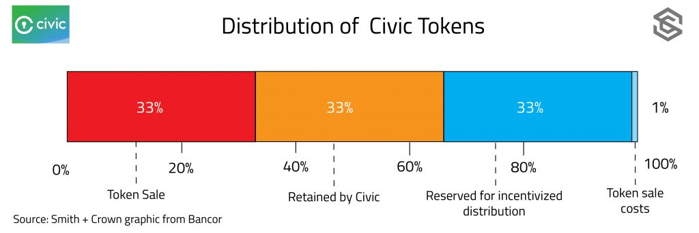

# Civic: a secure identity management platform built on the Rootstock protocol

### Project Description

Civic is launching a platform on the [Rootstock protocol](http://www.rsk.co/) for secure identity management that rewards users of the network for sharing and validating personal identifying information. When a user signs up for a service, they provide certain identifying information about themselves such as their name or email address. Later, when another member of the network needs to verify that user’s identifying information, they can send out a request for third party attestation. Any service provider that the user has interacted with in the past has the opportunity to earn CVC by validating user information through an attestation.

Secure storage of personal identifying information with easy user-controlled sharing of identification data using a patented application of elliptical-curve cryptography. Third party wallet integrations will provide a layer of protection between the user and Civic. Identification data are stored on the user’s device, and Civic will never have access to user private keys.

One of the first use cases is identity verification. Verifying identity today generally involves paying a third-party identity provider who can attest that the person is who they say they are, usually by referencing public documents that they have in their databases. Each authentication involves another check, which can typically cost 15 – 40 USD. Civic thinks that through network effects, they can bring the cost of authentication down 80 percent and the time to verify down 99 percent.

With Civic, users instead have a shareable token that proves the identifying information they present is associated with them. Identity information can be authenticated via trusted third-party attestation only once, and thereafter the user can furnish a unique private key to prove that attestation. It’s not Zcash zero-knowledge proof, but it is a proof-based system of authentication.

Future use cases for Civic include identity verification for e-banking and storage and sharing of medical records, though this latter is further out in their roadmap.

Civic [says the technology is patented](https://twitter.com/VinnyLingham/status/832731877144358912), though we were not able to locate the patent in the [US patent database](http://patft.uspto.gov/). Vinny Lingham has secured patents for a [previous startup Gyft](http://patft.uspto.gov/netacgi/nph-Parser?Sect1=PTO2&Sect2=HITOFF&u=%2Fnetahtml%2FPTO%2Fsearch-adv.htm&r=1&f=G&l=50&d=PTXT&p=1&S1=(Lingham.INNM.+AND+gift)&OS=IN/Lingham+AND+gift&RS=(IN/Lingham+AND+gift)). They state that the patent refers to the business process they have designed around elliptical-curve cryptography and that they plan to use the patent defensively.

### What is the token being sold?

The token being sold in an ERC-20 token (CVC) that will ultimately be redeemable for Rootstock meta-tokens once the app has been fully deployed on the Bitcoin-Rootstock blockchain. The Rootstock token will have [Payment Rights](https://www.smithandcrown.com/token-rights/) and will function as the sole means of payment on the network.

The token will primarily be used once the full marketplace of identity providers has been set up. In the short-term, the Ethereum token won’t be needed to use the app. Civic will serve as the identity verifier for basic identity fields, including name, address, email, phone number, social security number, and passport.

The basic identity verification app will be free for users, who will not need to acquire the token. Premium features, like identity protection, will likely cost extra, but Civic is not defining these features or their potential pricing. This approach (free for users) aligns with Civic’s vision to enable widespread user-owned identity data. Users may receive CVC for providing their data, though the reward mechanism hasn’t been defined.

Civic token users will be the companies requesting identity verification and the companies providing it. Civic thinks the token will ultimately be invisible on the platform: rather than acquire and hold a balance of CVC tokens, companies will be able to purchase them on the fly, though the mechanism for this is yet to be defined

### How is the token distributed?

 

### What is the project status?

Civic is a venture-backed US-based Delaware C-Corp. They will register token sale proceeds as revenue. In 2016, they raised [$2.75m from eight investors](https://www.crunchbase.com/organization/civic#/entity), including Blockchain Capital. They also raised an undisclosed amount in June.

They plan to wait for August 1st to see how the potential Bitcoin forks play out, but they are still committed to Rootstock as the deployment platform. They said work on this began before Ethereum was even an option, and they would rather focus on improving the product than porting to Ethereum.

Live now is their two-party authentication service. One of their first clients is [BnktotheFuture](https://bnktothefuture.com/), who can use Civic as a KYC provider for equity sales.

They are targeting Q1 2018 for the transition from the ERC-20 token to a Rootstock meta-token and the use of smart contracts for services. After that, they will build out the marketplace for identity verification and attestation and work on expanding coverage. Until the marketplace has been launched, Civic will serve as the identity verifier for basic identity fields, including name, address, email, phone number, social security number, and passport.

Code has not been released. Civic stated in the interview they will open-source it eventually and make it available after it’s been cleaned up and hardened.

Who is the competition?

Civic is not the only blockchain app trying to tackle secure identity management on a blockchain.

- [Uport](https://www.uport.me/) is an open source software project that aims to give users control over their digital identities. They released a live alpha testnet of their mobile app for iOS and Android earlier this year.
- [Air](https://tokeninvestor.com/crowdfunding/air) is a project built using a fork of Hyperledger’s fabric technology. They are currently raising funds through a token sale.
- [Blockstack](https://blockstack.org/) is a browser for running decentralized applications that gives users control over their personal information.
- [OpenID](http://openid.net/foundation/) is an open source software project and non profit foundation that advocates for the free and public use of identity management software. The [Google Identity Platform ](https://developers.google.com/identity/protocols/OpenIDConnect)makes use of openID technology.

Civic themselves declined to comment on competitors.

### Who is the team behind the project?

The team is led by [CEO Vinny Lingham](https://www.linkedin.com/in/vinnylingham) and [CTO Jonathan Smith](https://www.linkedin.com/in/jonathan-smith-2b997a/). Lingham is known in the space for the launch of Gyft, which develops [blockchain-powered gift cards](https://bravenewcoin.com/news/gyft-unveils-blockchain-powered-gift-cards/). Lingham [left Gyft early 2016](http://www.coindesk.com/gyft-founder-raises-2-75-million-for-id-startup-civic/) year to launch Civic. He serves as a [Bitcoin Foundation Board Member](https://bitcoinfoundation.org/about/board-of-directors/). His bio and LinkedIn background show him as a serial entrepreneur with a decade of experience working in e-commerce.

Jonathan Smith’s bio speaks to his more than 15 years of experience working in banking and technology advisory. Their technical partners are Rootstock, Jaxx, and [Bloq](http://bloq.com/). People from each of these companies are on their technical advisory board.

The project team made themselves available for an interview with the Smith + Crown research team.

### Official Resources

- [Website](https://www.civic.com/)
- Token sale [website](https://tokensale.civic.com/)
- [Whitepaper](https://tokensale.civic.com/CivicTokenSaleWhitePaper.pdf)
- [Bitcoin Talk](https://bitcointalk.org/index.php?topic=1942882.20)

### Original source

[Smith+Crown Research Team](https://www.smithandcrown.com/sale/civic/)