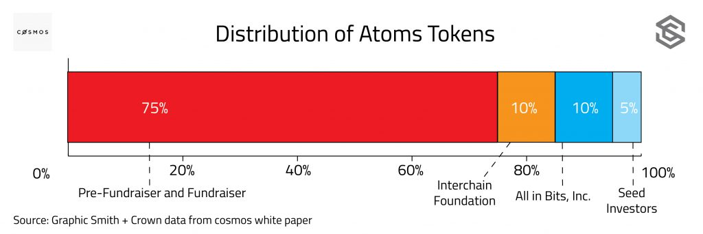

# Cosmos: a blockchain capable to interoperate with any other blockchain.

### Project Description

Cosmos is building a [Tendermint-based](https://tendermint.com/) proof-of-stake blockchain that will be interoperable with any blockchain, communicate with any programming language, and support any token asset. This is achieved through a network of “zones” connected to a main “hub”. The primary Cosmos blockchain will be the first hub on the network, but eventually there will be more. The hub acts as an intermediary between blockchain zones that otherwise would not be able to communicate with each other.

Zones are blockchains built using Tendermint consensus and connected to the main Cosmos hub, but which can be written in any coding language, maintain their own governance structure, and have an independent infrastructure of consensus nodes. Zones can have multiple functions. For example, a zone can be a new blockchain launched on the Cosmos platform, similar to launching an ER20 token on Ethereum. A zone can also function as a bridge between Cosmos and extra-ecosystem blockchains such as Bitcoin. The flexibility of zones and their ability to communicate to external blockchains as well as the primary Cosmos hub are what enable blockchain interoperability.

Cosmos aims to provide the following features.

- **Byzantine fault tolerance proof-of-stake**: Cosmos’ variation on Proof-of-stake is based on Practical Byzantine Fault Tolerance–a security protocol with roots in network theory, first proposed in the 1980s. It relies on a group of semi-trusted nodes to vote on blocks; as long as more than 2/3rds of the voting nodes are honest, the protocol will operate smoothly.  At launch, there will be 100 consensus nodes which will increase to 300 over 10 years. Consensus nodes are required to stake a share of tokens both as proof of their investment in the network and as collateral. Any node that is found to be acting maliciously will be removed from the system and have their staked tokens destroyed.
- **Cross-blockchain bridges**: Zones can function as bridges that communicate between incompatible blockchains and validate interchain transactions. Validator nodes operating on a Bridge-zones would keep up with the main Cosmos Hub, but also run a full-node of the “origin” blockchain, for example Bitcoin. When BTC-BridgeZone validators receive a payment from Bitcoin, they confirm that the appropriate amount of bitcoin has been committed, and then create a corresponding account with that balance on the BTC-BridgeZone blockchain. The original BTC will be locked in a multisignature P2SH pubscript until the BridgeZone validator sends a transaction unlocking them, thereby destroying a corresponding amount of tokens on the BridgeZone blockchain.
- **Decentralized Exchange**: The main Cosmos hub will function as a decentralized exchange by validating atom-swaps between zones.
- **Scalability**:Cosmos will be able to scale transaction capacity both on its core network and by supporting numerous other interoperable networks which function in parallel. In Cosmos, these networks are called ‘zones,’ and they maintain their own ledger according to their own consensus protocol and own core language. The Cosmos hub blockchain helps cannonize their states and supports interzone communication. In some ways, it is similar to Ethereum’s sharding proposal, though in Cosmos, the ‘shards’ can be other blockchains that can fail without compromising the network.
- **Democratic Governance**: Cosmos will have a governance structure that involves a formal process for validators to vote on proposals and an informal, human-readable constitution that lays out principles for the network and is ratified by validators.

### What is the token being sold?

The token being sold is the Atom. Atoms can be used for transaction fees on the main Cosmos hub; however, zones will be allowed to collect fees in any currency or combination of currencies of their choosing. Atoms are also needed participate in the consensus process–and earn both block rewards and transaction fees. To be a Validator, one must bond their Atoms (making them illiquid while serving as a Validator) and be among one of the top 100 (eventually the top 300) of the highest bonded balances . Others can delegate their share of Atoms to any Validator to increase their bond and share in the block rewards. Validators set their own terms with delegators, creating a market for cooperating in consensus.

The Atoms available in the crowdsale will not immediately be liquid: once created, they will vest at a constant rate per hour over the course of two years. Given the vesting rate over two years, if the sale raises $5 million and creates approximately 625,000 Atoms, they will vest at a rate of 35.6 Atoms per hour.

### What is the project status?

The Cosmos project is in the proof-of-concept stage. [Tendermint](https://github.com/tendermint/tendermint) consensus is fully developed, and code is available on github. A prototype version of the native cosmos cryptocurrency, called [basecoin](https://github.com/tendermint/basecoin), is completed a well. Integration of the Ethereum Virtual Machine with the Tendermint consensus mechanism also has prototype code available on [github](https://github.com/tendermint/ethermint). The Cosmos [distributed exchange](https://github.com/cosmos/cosmos/blob/master/DEX.md) is still in the concept stage.

The anticipated date for launching the network and distributing the unvested Atoms is sometime in Q3 2017.

### Competition and Challenges

Cosmos has a number of potential use cases derived from its utility as a decentralized exchange that is interoperable with any blockchain. Cosmos could function as a distributed exchange (DEX), a platform for cross-blockchain applications, and an issuer of meta-tokens.

The blockchain space has already seen several DEXs of the multi-blockchain-asset variety, including  [Bitsquare](https://bitsquare.io/), [Bitshares](https://www.smithandcrown.com/currency/bitshares/) ([Openledger](https://openledger.io/)), [SuperNET](https://supernet.org/en) ([InstantDex](https://www.instantdex.org/)). [Oasis](https://pro.oasisdex.com/) and [Counterparty](http://counterparty.io/) are examples of blockchain-specific DEXs for Ethereum and Bitcoin meta-tokens respectively. All of these platforms suffer from extremely low liquidity compared to the centralized alternatives such as [Poloniex](https://poloniex.com/) and [Bitfinex](https://www.bitfinex.com/). Accordingly, it’s perhaps best to view centralized exchanges rather than DEXs as the most direct competitors to a Cosmos based exchange.

In regards to enabling interoperability of applications, [Internet of Coins](https://www.smithandcrown.com/internet-coins-enabling-cross-chain-economies-hybrid-tokens/) and [ARK](https://ark.io/), like Cosmos, focus on some form of cross-blockchain value transfer. In a nutshell, they make it possible for arbitrary logic in bridging zones between blockchains to be triggered by the transfer of value in the form of tokens. However, Internet of Coins is still more than a year away from the release of their mainnet and isn’t actually communicating across blockchains but instead transferring value represented in hybrid tokens. Similarly, ARK will have to convince individual blockchains to make changes to their protocol in order to become interoperable with them. [Polkadot](http://polkadot.io/), led by Dr. Gavin Wood, goes one step further, aiming to facilitate cross-blockchain smart contract interoperability, that is, enabling the output of logic on one chain to interact as an input on another. Being able to initiate a transaction in Bitcoin by executing a contract in Ethereum, for example, would reduce the number of steps required to perform a cross-chain transaction using the Cosmos protocol.

Finally, although Ethereum is the current dominant token-issuance platform, [Ardor](https://www.ardorplatform.org/), [NEM](https://www.smithandcrown.com/new-economy-movement-nem/), [NXT](https://www.smithandcrown.com/currency/nxt/), [Onmi](http://www.omnilayer.org/)and [Waves](https://www.smithandcrown.com/waves-raises-2-million-on-first-day-of-ico/) also possess the functionality. Here, the long-run winners will be those that solve fundamental issues of scalability and security and benefit from network effects of applications seeking to use meta-tokens.

In general, blockchain platforms and decentralized changes are extremely prone to network effects. Historically, decentralized exchanges have met with little success primarily because of a lack of users low liquidity. In order to be successful, cosmos will need build a strong community of developers, validators, and users.

### Who is the team behind the project?

Cosmos is a project of the [Tendermint team](https://tendermint.com/about), who are currently working full time on the development of the Cosmos network. They are fully transparent with bios for every team member that link out to contact email addresses and Github, LinkedIn, and Twitter accounts.

CEO and founder [Jae Kwon](https://www.linkedin.com/in/yjkwon/)

- Founded Tendermint in 2014
- Co-founded [i done this](https://home.idonethis.com/?gclid=COXrove-3tICFQiSfgodAFcDbQ) a productivity app for teams
- Contributed development to multiple projects including Scramble.io, Flywheel networks, and Yelp.
- [Github](https://github.com/jaekwon?tab=overview&from=2009-12-01&to=2009-12-31)

CTO and Co-founder [Ethan Buchman](https://www.linkedin.com/in/ethan-buchman-10b34944/)

- Masters student at the University of Guelph
- More than two years of experience working as a research scientist
- First started his work with blockchain development in 2014 with [Eris industries](https://monax.io/platform/)
- [Github](https://github.com/ebuchman)

CDO Peng Zhong

- Self described autodidact with more than seven years of experience working as a full stack javascript developer for [Nylira](https://nylira.com/), a web development firm he started.
- [Github](https://github.com/nylira)

COO [Brian Fabian Crain](https://www.linkedin.com/in/bfcrain/)

- Co-founder and Co-host of [Epicenter](http://epicenterbitcoin.com/), a leading blockchain podcast.
- Previously the head of business development at [Eris Industries](https://monax.io/platform/)
- [Github](https://github.com/crainbf)

The Tendermint team also includes five software developers.

### Token Details

Role of token:	 		Used to stake nodes in PoS Conesnsus
Token supply:	 		TBA
Distributed in ICO:	 	75%
Emission rate:	 		Tokens vested gradually over two years
Mainnet release date:     	Eight months after ICO closes
Consensus method:	 	Tendermint

### ICO Details

Sale period:				March 31st, 2017 to April 28th, 2017
Token distribution date:	Vested at a constant rate per hour for two years
Min investment goal:     	TBA
Max investment cap:	 	TBA
How are funds held:	 	TBA
Bonus schedule:	 		TBA

### Official Resources

- [Website](https://cosmos.network/)
- [Team Page](https://tendermint.com/about)
- [Whitepaper](https://cosmos.network/whitepaper)
- [Roadmap](https://cosmos.network/blog/cosmos-roadmap)
- [Bitcointalk](https://bitcointalk.org/index.php?topic=1607111.new#new)
- [Github](https://github.com/cosmos/cosmos)
- [Blog](https://github.com/cosmos/cosmos)

### Original source

[Smith+Crown Research Team](https://www.smithandcrown.com/sale/cosmos/)