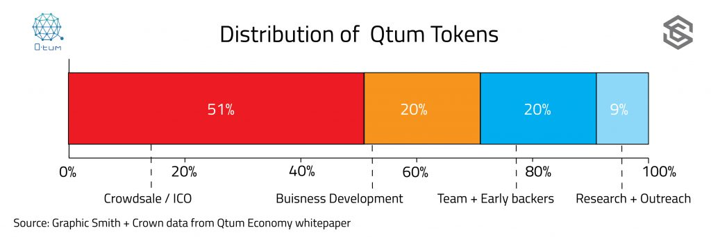
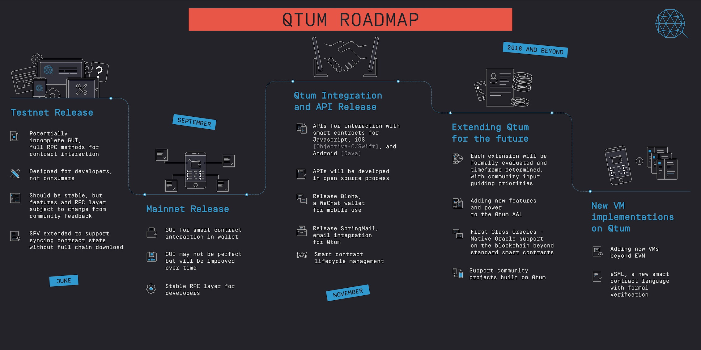

## Qtum aims to be a proof-of-stake, smart-contract compatible blockchain that can natively run both Bitcoin-based and Ethereum-based applications.

> Poniższy tekst jest w dużej mierze oparty na [recenzji Qtum](https://www.smithandcrown.com/qtum-ico-building-first-utxo-proof-stake-smart-contract-platform/) wykonanej przez [*Smith+Crown*](https://www.smithandcrown.com/about). Oryginalny tekst jest na tyle solidny i dobrze ustrukturyzowany, że uznałem że nie ma sensu na siłę tworzyć własnego, prościej jest przeredagować i uzupełnić tamten.

**Key Strengths**

- Qtum is the first to implement a protocol based on both Bitcoin’s and Ethereum’s transaction models. Developers on either chain in theory should be able to port applications easily.
- It is likely that the Chinese government will tend to support blockchain projects based in China. If the Chinese government chooses to discourage blockchains not based in China, Qtum could easily become a platform of choice for a growing developer community in this country.
- Qtum has one of the most impressive advisory teams the blockchain industry has seen in awhile. The success of platform technologies like Qtum, especially enterprise-oriented ones, will depend on business adoption. Qtum’s team has a collective network that touches many of the world’s largest companies.

**Key Concerns**

- The token will not be distributed until the mainnet launches, slated for Q3/4 of 2017. Investors can’t exit early if progress is delayed or they get uncomfortable with holding the token: there is a real chance of having nothing if the project never reaches a mainnet. They will also need to trust all parties to not lose information about who invested how much and when. If this information is held by exchanges and not shared with Qtum, then investors must hope the exchanges don’t get hacked or shut down. 
- While the governance structure is billed as a DAO, coinholders are only guaranteed the ability to vote in the staff of the Qtum Foundation. In addition, only 51% of the tokens are available during the ICO: 49% are held by the development team or initial investors in some way, although 29% will be held in transparent wallets until they are spent for various services in support of Qtum. Finally, the initial governance membership is set for two years, so coinholders will not have a say for awhile. It’s also not clear whether the 29% being withheld to pay for future services will be used in staking.
- Strong reliance on Qtum Foundation is an indicator of aiming for a relatively centralized governance model - at least when compared to Ethereum or EOS.
- The ‘capacity’ of the development community to build on yet another platform chain will be tested. Bitcoin and Ethereum have emerged as the primary platforms on which people can build, but more have emerged in 2016 (Waves, Lisk, Antshares) and more are in development (Cosmos, Rootstock, EOS). If each curates its own developer and user ecosystem, there will be large network effects that will leave some platforms niche or mostly empty. Qtum’s purported compatibility with both Ethereum and Bitcoin apps could mitigate this, though the team hasn’t released working app ports yet.
- There is some controversy around Qtum's lead developer Patrick Dai - he was apparently associated with the 2014 Bitbay scandal. Since then, accusations and suspicions have dogged the Qtum project - more details can be found [here](https://www.smithandcrown.com/qtum-controversy-patrick-dais-exit-bitbay/).

### Project description

Qtum will be a proof-of-stake (PoS), smart-contract compatible blockchain that can natively run both Bitcoin-based and Ethereum-based applications. The protocol uses Bitcoin’s [UXTO model](http://www.smithandcrown.com/definition/unspent-transaction-outputs-utxo/) of storing transactions, while also supporting oracles and two types of smart contracts. Applications built for Bitcoin, Etheruem, or either of their derivatives, should be able to port easily. The team is stacked with talent and experience, especially in business, and has framed Qtum as a the public ledger most prepared for business dapps.

- **Bitcoin + Ethereum compatible**: Qtum uses many features of the Bitcoin core blockchain, particularly its UTXO approach for storing transactions. This makes individual coins traceable. Qtum has a layer that abstracts the UTXO data into something the Ethereum Virtual Machine can read. This allows it to interact with both Bitcoin-based and Ethereum-based applications. Qtum will actually make this feature open-source, so any UTXO chain can use it to integrate with an EVM.
- **Protocol Governance**: Qtum will have a unique governance approach that is a hybrid of recognizable corporate governance, management models for open-source software, and blockchain-based consensus. The Qtum Blockchain Foundation, a Singapore non-profit, oversees the codebase, helps promote cohesion in the community, and represents Qtum to the external world. 50 people will staff one master committee and four sub-committees, with members serving two-year terms. Initial membership is already defined but the community will elect 50 representatives when their term is over.
- **Master Contracts**: are smart contracts that can execute based on off-chain or on-chain factors. Current designs of smart contracts are limited to checking on-chain data, so sources of off-chain data (oracles) must publish data to the chain itself; then whenever the smart contract is executed and verified, it checks readily-available on-chain data. Qtum has proposed a way for trusted data entities, such as official institutions or organizations, to provide data off-chain that master contracts can access.
- **Proof of Stake**: The team will use [Blackcoin](http://blackcoin.co/)’s proof-of-stake consensus model. Their outreach has led them to conclude businesses are not comfortable with a proof-of-work consensus model. Using a PoS model with some semi-trusted nodes would assuage CEOs that a rogue mining outfit or state-sponsored hashpower attack couldn’t disrupt the network.

In the future, Qtum will also have a native identity module that will provide users who register with a special designation that dapp developers and businesses can integrate with their on-chain activities. Some businesses are understandably uncomfortable with the thought of anonymous users. Identity could be solved at the application layer, but a native module would take the burden off developers. Users could still use Qtum without registering.

### What is the role of the token being sold?

The Qtum token serves multiple roles on the network. It’s used to pay fees, determine the distribution of newly minted tokens through a PoS mechanism, and grants holders voting rights in the Qtum governance organization.

**Fees**

Qtum tokens will be used to pay fees associated with executing smart contracts (similar to Ethereum’s Gas). Their draft white paper states: *Although Qtum uses the gas model from Ethereum, it is expected that the gas schedule (gas price of each EVM opcode) will significantly differ from Ethereum. This is because in Qtum some operations are more expensive than in Ethereum, and some operations are cheaper*.

**Proof of Stake Minting**

Token holders will be able to passively collect mining rewards by setting up a minting node and participating in consensus. Like other PoS schemes, validators will be required to stake some amount of their token holdings to earn rewards. [Coin age](https://www.smithandcrown.com/definition/coin-age/) and the size of the user’s stake will determine the distribution of rewards. Initially, Qtum tokens will be emitted at a rate of 1% a year. However, that rate may change in order to support a growing number of minting nodes. 

**Governance**

Many of the most important governance and business decisions will be made by the Qtum Judgment Committee, which serves many of the same functions as the board of directors would at a traditional corporation. The Judgement Committee consists of 9 core members. Every two years token holders will vote to elect 50 delegates. The delegates will then choose members to serve on the Judgement Committee. According to the [economy white paper](https://qtum.org/wp-content/uploads/2017/02/Qtum_blockchain_economy_whitepaper_20170217_EN.pdf), the weight of votes will depend on the “quantity and age of Qtum tokens possessed.”

### Token distribution

Initially, only 51 percent of Qtum tokens will be allocated to ICO participants. 20 percent will be distributed to the founding team and early investors and 29 percent will be used fund future research and development efforts.

Research and Outreach (9%): The 9 percent allocated for research and outreach will used to support the development of blockchain labs at universities in Asia. Outreach funds will also be used to foster relationships with Ubuntu, Linux, Firefox and other members of the opensource community.

Business Development (20%): At least 10 percent of business development tokens will be used for third-party development on Qtum, with the exact programs to be developed and managed by the Qtum Foundation.

Up to 10 percent of the tokens allocated for business development will be used to facilitate coin swaps with other blockchain networks, which the Qtum team hopes will encourage interchain collaboration. The swap will work like this: up to 10 percent of Qtum tokens will be used to obtain an equal proportion of tokens on another network, such as Ethereum. Qtum tokens will be distributed to all Ethereum users based on the size of their token holdings. Likewise, Qtum token holders will receive an allocation of Ether based on the size of their token holdings. Assuming that the leading communities of different blockchain networks could come to an agreement, this type of coin swap could benefit users on both networks. 

Team and Early backers (20%): By the end of the ICO, early backers will control 7-8% of Qtum tokens in return for their combined $1 million dollar seed investment. The founding team will control the remaining 12-13% of tokens.

Over time, proportional ownership of Qtum tokens will shift towards the community as new coins are minted and the Qtum Foundation uses their share of tokens to finance development efforts. Four years after launch, Qtum estimates that 80 percent of tokens will be owned by the community. The 29 percent that will be used for research, outreach, and business development will be held in wallet addresses anyone can view. The Qtum Foundation will determine how and when they get spent.

The Qtum token will be released with the mainnet, tentatively set for August / September 2017. Qtum doesn’t plan on distributing an IOU token, but individual exchanges may issue them and allow trading on Qtum redemption tokens to begin before the mainnet launch.

### What is the project status?

**The State of Qtum Technology**

Development of the Qtum core began in March of 2016. Since then, the Qtum team has expanded from a team of three developers to a team of more than a dozen developers with diverse backgrounds and specializations. In a recent interview with the Qtum team, Patrick Dai confirmed that they have a completed but “buggy” internal test net that isn’t public. A video of a [demo](https://qtum.org/en/videos/qtum-technical-introduction-and-demonstration) of the Qtum core test net was made available on the Qtum website. The video demonstrates how Qtum might be used by business to improve their supply chain management. Another demonstration video shows how Qtum has developed [mobile applications](https://qtum.org/en/videos/qtum-go-mobile-demo) that make it easy for developers to design smart contracts using an android smart phone, make payments using an apple watch, and manage accounts from a phone.

According to Jordan Earls, the lead developer on the Qtum project, the mainnet will go public by the end of summer 2017. The testnet still needs to undergo significant debugging, stress testing, and optimization. Prior to the official release, around June 2017, a public testnet will be launched alongside a bug bounty campaign.

**Initial seed funding**

Qtum has already undergone an initial round of funding. Their earliest backers are an impressive cohort of Blockchain entrepreneurs that includes [Anthony Di lorio](https://www.linkedin.com/in/anthonydiiorio1/), one of the original founders of Ethereum; and Weixing Chen the founder of [Kuaidi](https://www.kuaidi100.com/), a ride hailing service that [outcompeted Uber](http://www.forbes.com/sites/briansolomon/2016/08/01/uber-ends-billion-dollar-china-fight-makes-peace-with-rival-didi/#4a9ce4792ec0) and contributed to their decision to leave China.

**Early projects**

Qtum has already has a few significant dapp projects in development. [Spring Mail](http://www.bikaifa.com/blockchain-based-springemail-convert-every-email-into-cryptocurrency-wallet) promises to make sending cryptocurrency as easy as sending an email with a new Blockchain integrated Simple Mail Transfer Protocol (BiSMTP). Spring Mail works with existing SMTP protocols to facilitate the transfer of cryptocurrency between users.

In a similar vein, Qtum will also build a wallet called “[Qloha](http://www.nasdaq.com/article/qtum-connecting-blockchain-technology-with-the-commercial-world-cm732079)” on WeChat’s new “mini programs” platform. The WeChat wallet would allow users to send QTUM to other users as well as purchase products from WeChat store fronts.

Neither of these Dapps will be operational until after the launch of the mainnet. The Qtum team doesn’t plan to announce any other major business partnerships beyond Spring Mail and the WeChat wallet.

### Roadmap

**Testnet release (June 2017)**

- Potentially incomplete GUI, full RPC methods for contract interactions
- Designed for developers, not consumers
- Should be stable, but features and RPC layer subject to change from community feedback
- SPV extended to support syncing contract state without full chain download

**Mainnet release (September 2017)**

- GUI for smart contract interaction in wallet
- GUI may not be perfect but will be improved over time
- Stable RPC layer for developers

**Qtum integration and API release (November 2017)**

- APIs for interaction with smart contracts for JavaScript, iOS and Android
- APIs will be developed in open source process
- Release Qloha, a WebChat wallet for mobile use
- Release SpringWall, an email integration
- Smart-contract lifecycle management

**Extending Qtum for the future (2018 and beyond)**

- Each extension will be formally evaluated and timeframe determined
- Adding new features and power to the Qtum AAL
- First Class Oracles - oracle support on the blockchain beyond standard smart-contracts
- Support community projects built on Qtum

**New VM implementations**

- Adding new VMs beyond EVM
- eSML, a new smart-contract language with formal verification

### Who is the team behind the project?

Qtum has assembled an impressive advisory team from the Chinese Blockchain industry. However, in light of [the issues surrounding Qtum's lead developer Patrick Dai](https://www.smithandcrown.com/qtum-controversy-patrick-dais-exit-bitbay/), there is obvious reason to doubt the credentials of the development team. The Qtum English webpage does not provide surnames, Chinese names, or links to third-party identify verification like LinkedIn or GitHub; however, full names of team members can be found in the economy and technical white paper. To our knowledge, no one has proven information in the brief team bios was falsified, though Patrick Dai’s former involvement in BitBay was not disclosed.

**Connection to BitSe**

The development team has close ties to [Bitse](https://bitse.com/team/), a Chinese based blockchain project targeting business applications. The idea for Qtum reportedly grew out of Patrick Dai’s work as CTO at BitSe. Patrick Dai, Neil Mahi (BitSe’s Chief Blockchain architect), and Jordan Earls decided to create Qtum based on their experience working together at BitSe.

**Team member identity**

Five team members don’t seem to have easily discoverable online identities, including Neil Mahi, Dong Baiqiang, Mike Palencia, Amelie Zhao, and Time Markov. However, Time and Neil are listed as members of the development team at BitSe.

It is possible to locate the [GitHub repository](https://github.com/Earlz) of[ Jordan Earls](http://earlz.net/), Qtum’s lead developer. This contains numerous code reviews of other altcoins, though it has not been active for a year. He does not appear to have an easily-discoverable LinkedIn profile.

Developer [Caspal](https://www.linkedin.com/in/caspal/) was formerly employed at Baidu as a quality assurance developer, China’s most popular search engine, often described as the “Chinese Google”. He was also the target of accusations that Qtum faked his Rubik’s Cube record, but those claims were [debunked](https://www.smithandcrown.com/qtum-controversy-patrick-dais-exit-bitbay/).

[Alex Dulub](https://www.linkedin.com/in/dulub/) is the CEO at[ PixelPlex](http://www.pixelplex.by/), a Belarus-based Blockchain development lab. He has more than 10 years of experience working as a full-stack web developer. [Roman Asadchiy](https://www.linkedin.com/in/roman-asadchiy-388a5844/) is a project manager at PixelPlex with a background in business analysis. [Brett Fincaryk](https://www.linkedin.com/in/brett-fincaryk-35942b7a/) has more than 11 years of experience in Linux server management at [Userful](https://www.userful.com/).

### Competition

Qtum competes in the increasingly more competitive domain of smart-contract platforms, including Ethereum, Tezos, EOS, Lisk, Stratis etc. In terms of technology the most similar project seems to be [Rootstock](http://www.rsk.co), which also aims to add smart-contract capability to Bitcoin.

### Official resources

- [Website](https://qtum.org/)
- Technical [white paper](https://qtum.org/wp-content/uploads/2017/01/Qtum-technical-white-paper-draft-version.pdf)
- Governance and Economy [white paper](https://qtum.org/wp-content/uploads/2017/02/Qtum_blockchain_economy_whitepaper_20170217_EN.pdf)
- [Bitcointalk](https://bitcointalk.org/index.php?topic=1720632.0)
- [Github](https://github.com/qtumproject/)

### Other resources

[Qtum: Connecting Blockchain Technology With the Commercial World](https://bitcoinmagazine.com/articles/qtum-connecting-blockchain-technology-with-the-commercial-world-1484145776/)

[Blockchain Angels Invest $1 Million in Bitcoin-Ethereum Hybrid Qtum](http://www.coindesk.com/blockchain-angels-invest-1-million-bitcoin-ethereum-hybrid-qtum/)

[Qtum: Connecting Blockchain Technology With the Commercial World](http://www.nasdaq.com/article/qtum-connecting-blockchain-technology-with-the-commercial-world-cm732079)

[Qtum ICO: Building the first UTXO proof-of-stake smart contract platform](https://www.smithandcrown.com/qtum-ico-building-first-utxo-proof-stake-smart-contract-platform/)

### Original source

Most of the content orginates from [Qtum's review by Smith+Crown](https://www.smithandcrown.com/qtum-ico-building-first-utxo-proof-stake-smart-contract-platform/).

